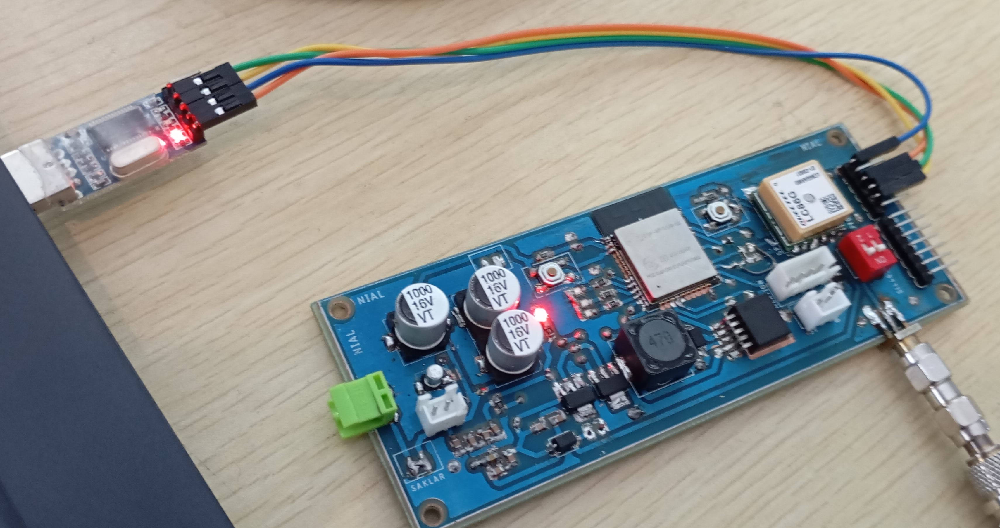

# ais-nmea-encode
encode ais nmea message 18, 24A, 24B

# How to Build
```bash
mkdir build && cd build
cmake ../encode/ && cmake --build .
```

# Run
```bash
# running c code
./ais_nmea_encode

# running c++ code
./ais_nmea_encode_example
```

# Pictures

